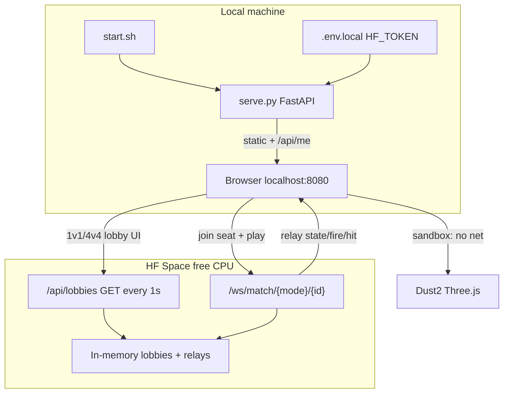

# Multiplayer lobbies + weapon combat sync

## Architecture (as specified)




- **Local**: still `bash start.sh` → `http://localhost:8080`. Sandbox = current 1v-none (offline).
- **Online**: browser loads game locally; only lobby/match traffic goes to the HF Space URL (from `.env.local`).
- **Identity**: local server calls Hugging Face `whoami` with `HF_TOKEN` and exposes `{ username }` to the client. Username is the player id. Token never goes to the browser.
- **Server role**: dumb lobby board + message relay (same philosophy as `[ref/src/ws/relay.py](ref/src/ws/relay.py)`). Physics/hits stay client-side; shooter/attacker authoritative like ref.

## Defaults locked for reliability


| Setting          | Value                                                                   |
| ---------------- | ----------------------------------------------------------------------- |
| 1v1 lobbies      | **8** fixed (`1v1-0` … `1v1-7`), seats `A` / `B`                        |
| 4v4 lobbies      | **4** fixed (`4v4-0` … `4v4-3`), sides `teamA` / `teamB` (4 seats each) |
| Lobby board poll | **1.0s**                                                                |
| In-match state   | **20 Hz** position/aim/hp/weapon (from ref)                             |
| Deploy target    | One HF Space (CPU basic), FastAPI + WebSocket, no Gradio UI required    |


## UI flow

1. **Start screen** (DOM overlay on existing HUD pattern in `[index.html](index.html)` / `[css/style.css](css/style.css)`): Sandbox | 1v1 | 4v4. Back stays available.
2. **Sandbox**: hide menu → current boot (`player.enable`, weapons, map) unchanged.
3. **1v1 / 4v4 lobby screen**: scrollable list of fixed lobbies; each row shows seats/sides and usernames; Join seat if empty; Leave; Back to start. Data from `GET {HF_SPACE_URL}/api/lobbies` every 1s.
4. **Match**: on seat claim, open WebSocket to Space; when lobby full (2 for 1v1, 8 for 4v4) server sends `match_start` with spawns/roles → enter Dust2 scene with remote ghosts; Esc/leave returns to lobby board.

Gate gameplay until mode chosen: pause pointer-lock / weapon input (`PlayerController.disable`, weapons `paused` flag) while menus are open.

## Local server changes

Upgrade `[serve.py](serve.py)` (still launched by `[start.sh](start.sh)`):

- Serve static files (current behavior).
- Load dotenv from `.env.local`.
- `GET /api/me` → `{ "username": "..." }` via HF Hub whoami (fail clearly if token missing for online modes; sandbox still works without token).
- `GET /api/config` → `{ "spaceUrl": "..." }` from env so the client knows where to connect.

Add `[.env.example](.env.example)`:

```
HF_TOKEN=
HF_SPACE_URL=https://<user>-<space>.hf.space
```

Document in `[README.md](README.md)`: copy to `.env.local`, create/deploy Space, set token.

## HF Space game server (new package, not Gradio game UI)

New deployable tree e.g. `[server/](server/)` (code inspired by `ref/`, not the broken Gradio SP snapshot in `ref/hf_space/`):

- **In-memory lobby board**: fixed slots; `claim` / `leave` / `heartbeat` (drop stale seats ~5s).
- `**GET /api/lobbies**`: full board snapshot for 1s client poll.
- `**POST /api/lobbies/{mode}/{lobbyId}/claim**`: body `{ username, side|seat }`; reject if taken or username already seated elsewhere.
- `**WS /ws/match/{mode}/{lobbyId}?user=**`: join room relay; fan-out messages to other members; on disconnect free seat + `player_left`.
- `**match_start**`: when capacity reached; assign spawn indices on Dust2 (reuse map corners/sides — define a small spawn table in JS).
- CORS open for `localhost:8080`.
- `Dockerfile` / Space README for CPU basic deploy.

Lobby sync is **server-authoritative** for seats only. Match combat remains **relayed** like ref.

## Client networking module

New `[js/net.js](js/net.js)` (+ thin `[js/ui-menu.js](js/ui-menu.js)`):

- Fetch `/api/me` + `/api/config`.
- Lobby poller (1s) + claim/leave.
- Match WebSocket send/recv.
- Ghost players: one mesh/capsule per remote username; lerp position like ref `ghostState`.
- Wire into `[js/main.js](js/main.js)` animate loop only when in online match.

## Combat sync (generalize ref axe → current weapons)

Current repo has **no HP/damage** (`[js/weapons.js](js/weapons.js)` is VFX-only). Add minimal local combat used by both sandbox-optional and required for PvP:

**Shared combat rules (new `js/combat.js`):**

- `MAX_HP = 100`; death → respawn after short delay (or match end in 1v1 when one side wiped — 1v1: first to eliminate opponent wins; 4v4: team wipe or timed — **use elimination: last team with alive players wins**).
- Hit zones simplified: `head` / `body` (reuse character AABB/capsule; head = upper 20% height).
- Damage tables per weapon (tunable constants): MG/sniper hitscan, melee cone, flame tick/s, grenade radial falloff.

**Message types (relayed, attacker-authoritative like ref):**


| type              | purpose                                                                       |
| ----------------- | ----------------------------------------------------------------------------- |
| `ready`           | username present                                                              |
| `state`           | `pos`, `rot`, `hp`, `weapon`, `action` @20Hz                                  |
| `fire`            | hitscan: `weapon`, `origin`, `dir`, optional `hitUser`, `zone`, `damage`      |
| `flame`           | tick: `origin`, `dir`, `hitUsers[]` + damages (rate-limited)                  |
| `grenade_throw`   | `origin`, `vel`, `fuse` — peers spawn visual grenade                          |
| `grenade_explode` | `pos`, `radius` — peers VFX; thrower also sends `hit` for each damaged player |
| `melee`           | `origin`, `dir`, `hitUser`, `zone`, `damage`                                  |
| `hit`             | apply damage to local player if `target === me`                               |
| `match_end`       | winner side / usernames                                                       |


**Integration points in weapons (wrap, don’t rewrite graphics):**

- Ballistic `_fireBallistic`: after local raycast, if online and ray hits a ghost capsule → `fire` + `hit`.
- Flamethrower `update` cone: each ~100ms test ghosts in cone → `flame`/`hit`.
- Grenade fuse end: local `explodeAt` stays; add radial damage vs ghosts + self; broadcast `grenade_explode` + `hit`s.
- Melee swing apex: short-range capsule test → `melee`/`hit`.
- Remotes: play tracers/flame/grenade/melee VFX from messages without dealing damage twice (`fromRemote` flag, same as ref `fromOpponent`).

Sandbox: combat HP can stay off (current feel) unless you want training dummies later — **default: sandbox remains no-HP 1v-none**.

## Files to add/touch (high level)


| Area         | Files                                                                                                                                                         |
| ------------ | ------------------------------------------------------------------------------------------------------------------------------------------------------------- |
| Env / docs   | `.env.example`, `.gitignore` (`.env.local`), `README.md`                                                                                                      |
| Local host   | `serve.py`, `start.sh` (pip install fastapi/uvicorn/httpx/python-dotenv)                                                                                      |
| HF server    | `server/app.py`, `server/lobbies.py`, `server/relay.py`, `server/requirements.txt`, `server/README.md`                                                        |
| UI           | `index.html`, `css/style.css`, `js/ui-menu.js`                                                                                                                |
| Net + combat | `js/net.js`, `js/combat.js`, hooks in `js/weapons.js`, `js/main.js`, thin ghost helper                                                                        |
| Ignore       | Do not build from / modify large `ref/assets`; only reuse relay ideas from `ref/src/ws/relay.py` + PvP message patterns from `ref/src/static/archer_arena.js` |


## Phased delivery (reliable order)

1. **Menu + sandbox gate** (local only, no Space).
2. **Local `/api/me` + `.env.example`**.
3. **HF Space lobby board** (claim/leave/1s snapshot) + lobby UI.
4. **Match WS relay + ghosts + state@20Hz**.
5. **Combat + per-weapon messages** wired into existing weapon paths.
6. **4v4 seats/spawns/team win** on same relay (fan-out already N-player).

## Out of scope

- Rewriting Dust2 graphics or replacing weapons with axe.
- Server-side physics validation / anti-cheat beyond seat ownership.
- Gradio dataset recorder from ref (not required for play).
- Shipping `ref/assets/ph-assets` inside this game.

## ERROR IN YOUR PLAN : 

- sandbox is also a served option with netwrk along with 1v1 and 4v4.
- 1v1 lobby games start once both side slots are filled
- 4v4 lobbies start either when they are full or when noone joins or leaves for 60sec AND there is alteats one person on each side.

